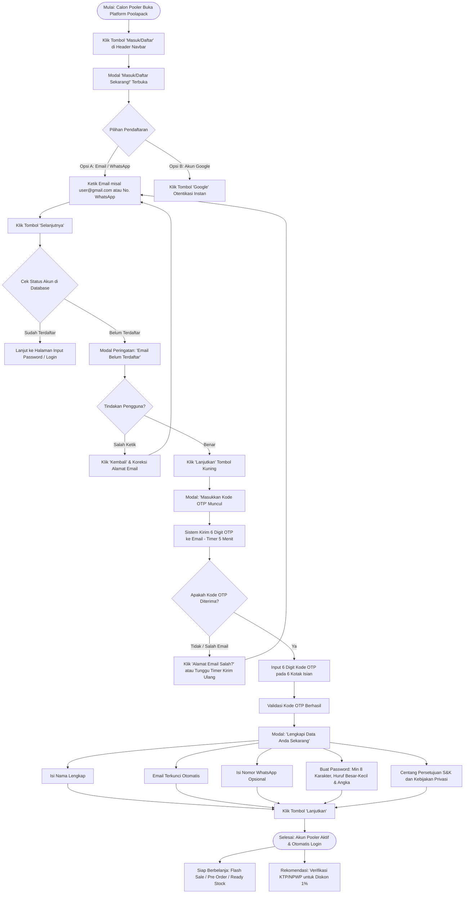
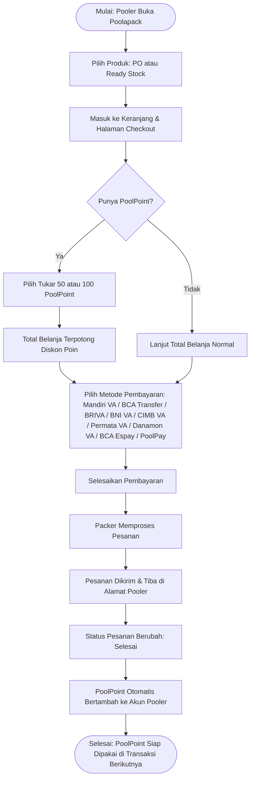
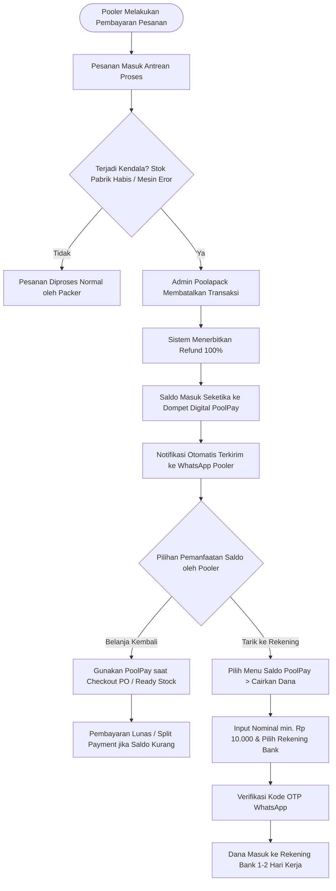
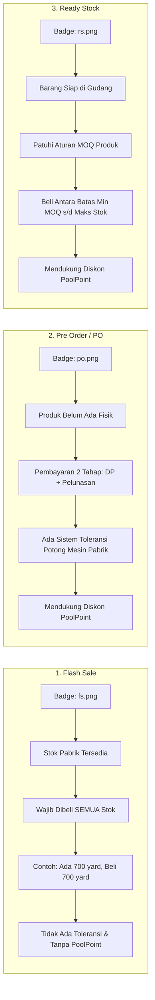
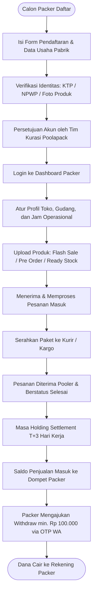
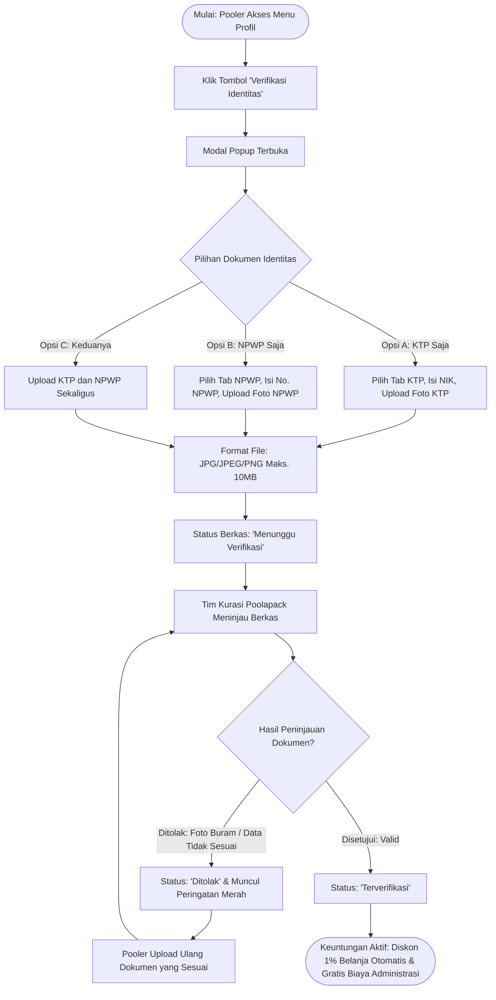

# Poolapack Care — Pusat Bantuan & Panduan Resmi

> **Poolapack Care** adalah portal pusat bantuan, dokumentasi, dan panduan transaksi resmi untuk ekosistem **Poolapack**. Mengadopsi standar antarmuka dan pengalaman pengguna bersih ala *Tokopedia Care*, portal ini menyajikan panduan komprehensif bagi **Pooler (Pembeli)** dan **Packer (Penjual / Produsen Pabrik)**.

---

## Daftar Isi
1. [Tentang Poolapack & Care](#tentang-poolapack--care)
2. [Terminologi Resmi Platform](#terminologi-resmi-platform)
3. [Fitur-Fitur Utama](#fitur-fitur-utama)
4. [Diagram Alur Sistem (Flowcharts)](#diagram-alur-sistem-flowcharts)
   - [1. Alur Registrasi Akun Pooler (Masuk/Daftar & OTP)](#1-alur-registrasi-akun-pooler-masukdaftar--otp)
   - [2. Alur Pemesanan & Opsi Pengaturan Alamat](#2-alur-pemesanan--opsi-pengaturan-alamat-pengguna-baru)
   - [3. Alur Belanja & Perolehan PoolPoint](#3-alur-belanja--perolehan-poolpoint)
   - [4. Alur Pembatalan & Refund Otomatis ke PoolPay](#4-alur-pembatalan--refund-otomatis-ke-poolpay)
   - [5. Alur 3 Kategori Produk (Flash Sale, Pre Order, Ready Stock)](#5-alur-3-kategori-produk-flash-sale-pre-order-ready-stock)
   - [6. Alur Onboarding & Transaksi Packer (Penjual)](#6-alur-onboarding--transaksi-packer-penjual)
   - [7. Alur Pencarian & Filter Audiens](#7-alur-pencarian--filter-audiens)
   - [8. Alur Verifikasi Identitas & Diskon 1%](#8-alur-verifikasi-identitas-ktp--npwp--diskon-1)
5. [Struktur Direktori Project](#struktur-direktori-project)
6. [Daftar 25 Artikel Panduan](#daftar-25-artikel-panduan)
7. [Teknologi yang Digunakan](#teknologi-yang-digunakan)
8. [Panduan Instalasi & Menjalankan](#panduan-instalasi--menjalankan)

---

## Tentang Poolapack & Care

**Poolapack** adalah marketplace B2B & kemasan/packaging yang menghubungkan langsung pembeli dengan produsen dan pabrik tangan pertama. 

Portal **Poolapack Care** dibangun untuk menjawab kebutuhan informasi seputar:
- Pendaftaran akun dan keamanan data.
- Alur pemesanan dan pelacakan status pesanan.
- Berbagai metode pembayaran, termasuk penggunaan saldo digital **PoolPay**.
- Pemanfaatan poin reward **PoolPoint** untuk potongan belanja.
- Karakteristik dan mekanisme 3 model produk: **Flash Sale**, **Pre Order (PO)**, dan **Ready Stock**.
- Manajemen toko, katalog produk, dan penarikan saldo bagi Packer.

---

## Terminologi Resmi Platform

| Istilah Resmi | Definisi & Peran |
| :--- | :--- |
| **Pooler** | Sebutan resmi untuk **Pembeli (Buyer)** di platform Poolapack yang memesan produk kain, kemasan, atau packaging. |
| **Packer** | Sebutan resmi untuk **Penjual (Seller / Merchant / Pabrik / Produsen)** yang memproduksi dan menyediakan stok produk di Poolapack. |
| **PoolPoint** | Poin reward loyalitas yang otomatis diperoleh Pooler saat pesanan selesai. Dapat digunakan untuk potongan harga di produk PO dan Ready Stock (pilihan 50 atau 100 poin). |
| **PoolPay** | Dompet saldo digital bawaan akun Pooler. Saldo terisi 100% otomatis saat admin membatalkan transaksi yang sudah dibayar. Saldo dapat dipakai belanja lagi atau ditarik ke rekening bank pribadi. |

---

## Fitur-Fitur Utama

### 1. Desain & Branding "Poolapack Care"
- **Header Lockup**: Brand logo SVG Poolapack dengan separator vertikal dan teks label `Care`.
- **Hero & Search Bar**: Input pencarian interaktif dengan real-time autocomplete dropdown yang menyorot (highlight) kata kunci yang dicari.
- **Topik Kategori 3×2**: Tampilan grid kategori bersih dengan ikon intuitif.

### 2. Tab Filter Audiens (Pooler vs Packer)
- Pada halaman pencarian, pengguna dapat memfilter hasil secara spesifik:
  - **Untuk Pooler (Pembeli)**: Menampilkan artikel seputar belanja, lacak pesanan, refund, PO, Ready Stock, Flash Sale, dan PoolPoint.
  - **Untuk Packer (Penjual)**: Menampilkan artikel pembukaan toko, verifikasi identitas, manajemen stok katalog, dan ketentuan penarikan saldo toko.

### 3. Mesin Pencarian Cerdas (Fuzzy Search & Stemmer)
- Dilengkapi kamus sinonim (*Synonym Map*) untuk istilah bahasa Indonesia dan Inggris (misal: *beli*, *order*, *checkout*, *pooler*, *packer*, *refund*, *kembali dana*, *poolpay*, *point*, *ongkir*).
- Algoritma pencocokan multi-token dan pembobotan relevansi (judul berbobot lebih tinggi dibanding isi konten).

### 4. Pembaca Artikel Interaktif
- **Reading Progress Bar**: Indikator persentase membaca di sisi paling atas layar.
- **Daftar Isi (TOC) & Scroll Spy**: Melacak posisi pembacaan secara aktif dan mendukung smooth-scroll ke setiap sub-judul artikel.
- **Callout Boxes**: Kotak peringatan (*warning*) dan informasi penting (*info*) untuk tips esensial transaksi.
- **Floating Help Widget**: Akses instan menuju layanan Customer Care / WhatsApp resmi Poolapack.

### 5. Multi-Channel Pembayaran & Fitur Split Payment
- **8 Channel Pembayaran Resmi**: Mendukung Mandiri Virtual Account, BCA Transfer, CIMB Virtual Account, BRI Virtual Account (BRIVA), BNI Virtual Account, Permata Virtual Account, Danamon Virtual Account, dan BCA Espay.
- **Variasi Fee Pembayaran**: Masing-masing metode pembayaran memiliki struktur biaya pembayaran (fee transaksi) yang bervariasi dan dirinci transparan pada saat checkout.
- **Split Payment**: Fitur `+ Tambah Split Pembayaran` untuk mengombinasikan saldo refund digital PoolPay dengan salah satu channel pembayaran perbankan resmi.

### 6. Verifikasi Identitas & Benefit Diskon 1% (Promo & Reward)
- **Kategori Promo & Reward**: Panduan verifikasi identitas (KTP / NPWP) ditempatkan pada topik *Promo & Reward* karena memberikan keuntungan langsung potongan promo diskon sebesar 1% pada setiap transaksi belanja.
- **Fleksibilitas Dokumen**: Pooler dapat memverifikasi akun menggunakan **KTP** saja, **NPWP** saja, atau **keduanya sekaligus** melalui menu *Profil > Verifikasi Identitas*.
- **Diskon 1% Otomatis**: Akun yang status identitasnya telah terverifikasi berhak memperoleh potongan diskon sebesar **1%** di setiap transaksi belanja.
- **Bebas Biaya Administrasi**: Mendapatkan fasilitas gratis biaya administrasi sesuai ketentuan platform.

---

## Diagram Alur Sistem (Flowcharts)

### 1. Alur Registrasi Akun Pooler (Masuk/Daftar & OTP)



---

### 2. Alur Pemesanan & Opsi Pengaturan Alamat (Pengguna Baru)

```mermaid
flowchart TD
    A([Mulai: Pooler Buka Platform Poolapack]) --> B{Status Alamat Pengguna Baru?}
    
    B -- Opsi A: Atur di Awal --> C[Klik Banner Merah 'Yuk Atur Lokasi' atau Profil > Alamat]
    C --> D[Isi Nama, No. WhatsApp, Titik Pin & Simpan Alamat]
    D --> E[Pilih Produk Kain di Katalog / Beranda]

    B -- Opsi B: Langsung Belanja --> E
    E --> F[Lihat Detail Varian: Warna, Grade, Lebar, GSM & Yard]
    F --> G[Klik 'Beli Sekarang' atau Masukkan Keranjang]
    G --> H[Halaman Checkout]
    
    H --> I{Apakah Alamat Sudah Ada?}
    I -- Belum --> J[Klik '+ Tambah Alamat' Langsung di Halaman Checkout]
    J --> K[Alamat Tersimpan & Ongkir Dihitung Otomatis]
    I -- Sudah --> K

    K --> L{Pilih Metode Penerimaan Barang}
    L -- Dikirim ke Alamat --> M[Pilih Layanan Ekspedisi Resmi misal Poolpack Ekspedisi]
    L -- Ambil Sendiri --> N[Pilih 'Diambil di Pabrik/Gudang' Bebas Ongkir]

    M --> O[Pilih Metode Pembayaran: Mandiri VA / BCA Transfer / BRIVA / BNI VA / CIMB VA / Permata VA / Danamon VA / BCA Espay]
    N --> O

    O --> P{Gunakan Fitur Split Pembayaran?}
    P -- Ya --> Q[Klik '+ Tambah Split Pembayaran' Gabung Saldo PoolPay + Channel Pembayaran]
    P -- Tidak --> R[Pembayaran Penuh via Satu Metode (Fee Disesuaikan)]
    Q --> S[Klik 'Lanjutkan Pembayaran']
    R --> S

    S --> T[Halaman Menunggu Pembayaran dengan Countdown Timer]
    T --> U[Salin No. VA & Nominal via Tombol Copy]
    U --> V[Lakukan Transfer via M-Banking / ATM]
    V --> W[Klik 'Cek Status Pembayaran 🔄' atau Verifikasi Otomatis]
    W --> X[Status Berubah: Diproses & Packer Siapkan Pesanan]
    X --> Y[Pesanan Dikirim / Siap Diambil di Gudang]
    Y --> Z([Selesai: Pesanan Diterima Pooler & PoolPoint Diberikan])
```

---

### 3. Alur Belanja & Perolehan PoolPoint



---

### 4. Alur Pembatalan & Refund Otomatis ke PoolPay



---

### 5. Alur 3 Kategori Produk (Flash Sale, Pre Order, Ready Stock)



---

### 6. Alur Onboarding & Transaksi Packer (Penjual)



---

### 7. Alur Pencarian & Filter Audiens

```mermaid
flowchart TD
    A([User Masukkan Kata Kunci]) --> B[Mesin Stemming & Pemetaan Sinonim]
    B --> C[Filter Berdasarkan Query Pencarian]
    C --> D{Pilih Tab Audiens}
    D -- Untuk Pooler --> E[Filter: audience == 'pembeli' || 'semua']
    D -- Untuk Packer --> F[Filter: audience == 'penjual' || 'semua']
    E --> G[Tampilkan Hasil Relevan untuk Pembeli]
    F --> H[Tampilkan Hasil Relevan untuk Penjual]
```

---

### 8. Alur Verifikasi Identitas (KTP / NPWP) & Diskon 1%



---

## Struktur Direktori Project

```text
userguidepoolapack/
├── assets/
│   └── css/
│       └── main.css             # Konfigurasi styling global Tailwind
├── components/
│   ├── article/
│   │   └── ArticleCard.vue      # Card preview artikel
│   ├── category/
│   │   ├── CategoryCard.vue     # Card kategori topik
│   │   └── CategoryGrid.vue     # Grid tata letak kategori
│   ├── common/
│   │   ├── HelpFloatingWidget.vue # Widget bantuan melayang
│   │   └── SearchBar.vue        # Komponen input search dengan autocomplete
│   ├── layout/
│   │   ├── Footer.vue           # Footer resmi Poolapack Care
│   │   └── Navbar.vue           # Header lockup (Poolapack | Care)
│   └── sections/
│       ├── ContactSection.vue   # Kontak bantuan & channel CS
│       ├── FAQSection.vue       # Pertanyaan yang sering diajukan
│       ├── HeroSection.vue      # Banner utama pencarian
│       └── TrustSection.vue     # Nilai keunggulan platform
├── data/
│   └── content.ts               # Sumber data utama: 6 kategori, 24 artikel, search engine & sinonim
├── icon/
│   ├── fs.png                   # Badge label Flash Sale
│   ├── po.png                   # Badge label Pre Order
│   └── rs.png                   # Badge label Ready Stock
├── layouts/
│   └── default.vue              # Master layout aplikasi
├── pages/
│   ├── index.vue                # Beranda Poolapack Care
│   ├── search.vue               # Halaman pencarian & filter audiens
│   ├── article/
│   │   └── [slug].vue           # Halaman detail artikel & TOC Scroll Spy
│   └── category/
│       └── [slug].vue           # Halaman arsip artikel per kategori
├── public/
│   ├── icons/                   # Logo Poolapack, icon SVG, dan ilustrasi
│   └── images/                  # Aset grafis pendukung
├── types/
│   └── index.ts                 # TypeScript interfaces (Article, Category, TocItem)
├── nuxt.config.ts               # Konfigurasi Nuxt 3, Tailwind, dan Meta tags
├── package.json                 # Dependensi & NPM scripts
├── tailwind.config.ts           # Desain token, palet warna, dan tipografi
└── tsconfig.json                # Konfigurasi compiler TypeScript
```

---

## Daftar 25 Artikel Panduan

| No | Slug Artikel | Judul Artikel | Kategori | Audiens |
| :---: | :--- | :--- | :--- | :---: |
| 1 | `cara-daftar-akun-poolapack` | Cara Mendaftar Akun Poolapack | Akun & Keamanan | Pooler |
| 2 | `cara-verifikasi-email` | Cara Verifikasi Email | Akun & Keamanan | Pooler |
| 3 | `cara-ganti-password` | Cara Mengganti Password Akun | Akun & Keamanan | Pooler |
| 4 | `lupa-password` | Lupa Password? Begini Cara Reset | Akun & Keamanan | Pooler |
| 5 | `cara-verifikasi-nomor-hp` | Cara Verifikasi Nomor HP | Akun & Keamanan | Pooler |
| 6 | `cara-daftar-akun-seller` | Cara Mendaftar sebagai Packer (Penjual) di Poolapack | Akun & Keamanan | Packer |
| 7 | `cara-buka-toko-poolapack` | Cara Membuka dan Mengatur Profil Toko Packer di Poolapack | Akun & Keamanan | Packer |
| 8 | `cara-melakukan-pemesanan` | Cara Melakukan Pemesanan di Poolapack | Pesanan | Pooler |
| 9 | `cara-tambah-atur-alamat` | Cara Menambahkan dan Mengatur Alamat Pengiriman | Pesanan | Pooler |
| 10 | `cara-mengajukan-rfq-kain` | Cara Mengajukan RFQ (Request for Quotation) Kain Kustom | Pesanan | Pooler |
| 11 | `cara-batalkan-pesanan` | Cara Membatalkan Pesanan | Pesanan | Pooler |
| 12 | `cara-atur-produk-stok-harga` | Cara Mengelola Produk, Stok, dan Harga Jual di Dashboard Packer | Pesanan | Packer |
| 13 | `metode-pembayaran-tersedia` | Metode Pembayaran yang Tersedia di Poolapack & Ketentuan Biaya (Fee) | Pembayaran | Pooler |
| 14 | `cara-bayar-transfer-bank` | Cara Bayar via Virtual Account Bank (Mandiri, BRI, BNI, CIMB, Permata, Danamon) | Pembayaran | Pooler |
| 15 | `cara-bayar-bca-espay` | Cara Bayar via BCA Transfer & BCA Espay di Poolapack | Pembayaran | Pooler |
| 16 | `cara-ajukan-refund` | Cara Mengajukan Pengembalian Dana (Refund) | Pembayaran | Pooler |
| 17 | `ketentuan-penarikan-saldo-penjual` | Ketentuan dan Cara Mengajukan Penarikan Saldo bagi Packer (Penjual) | Pembayaran | Packer |
| 18 | `jasa-pengiriman-tersedia` | Jasa Pengiriman yang Bekerjasama dengan Poolapack | Pengiriman | Pooler |
| 19 | `estimasi-waktu-pengiriman` | Estimasi Waktu dan Jadwal Operasional Pengiriman | Pengiriman | Pooler |
| 20 | `cara-verifikasi-identitas` | Cara Mendapatkan Diskon Sebesar 1% dengan Verifikasi Identitas (KTP / NPWP) | Promo & Reward | Pooler |
| 21 | `apa-itu-poolpoint` | Apa Itu PoolPoint dan Cara Menggunakannya? | Promo & Reward | Pooler |
| 22 | `apa-itu-poolpay` | Bagaimana cara mencairkan saldo poolpay? | Promo & Reward | Pooler |
| 23 | `flash-sale-poolapack` | Apa Itu Flash Sale di Poolapack? | Kategori Produk | Pooler |
| 24 | `pre-order-poolapack` | Panduan Pre Order (PO): Cara Pesan, Bayar Bertahap, dan Sistem Toleransi | Kategori Produk | Pooler |
| 25 | `ready-stock-poolapack` | Panduan Ready Stock: MOQ, Stok Tersedia, dan Cara Membeli | Kategori Produk | Pooler |

---

## Teknologi yang Digunakan

- **Framework**: [Nuxt 3](https://nuxt.com/) (Vue 3 + Vite + Nitro Engine)
- **Styling**: [Tailwind CSS](https://tailwindcss.com/) dengan palet custom (kuning amber khas Poolapack)
- **Ikonografi**: [@iconify/vue](https://iconify.design/) (Phosphor Icons pack)
- **Bahasa**: [TypeScript](https://www.typescriptlang.org/)
- **Arsitektur Rendering**: Universal Rendering (SSR & Pre-rendering support)

---

## Panduan Instalasi & Menjalankan

### Persyaratan Sistem
- Node.js versi 18.x atau 20.x+
- NPM versi 9.x+

### 1. Kloning atau Buka Direktori Project
```bash
cd /home/kalialbi/Downloads/userguidepoolapack
```

### 2. Instalasi Dependensi
```bash
npm install
```

### 3. Menjalankan Server Pengembangan (Dev)
```bash
npm run dev
```
Aplikasi dapat diakses melalui browser di `http://localhost:3000`.

### 4. Pengecekan Tipe Data (Typecheck)
```bash
npx tsc --noEmit
```

### 5. Membangun untuk Produksi (Build)
```bash
npm run build
```

### 6. Preview Hasil Build Produksi
```bash
npm run preview
```
